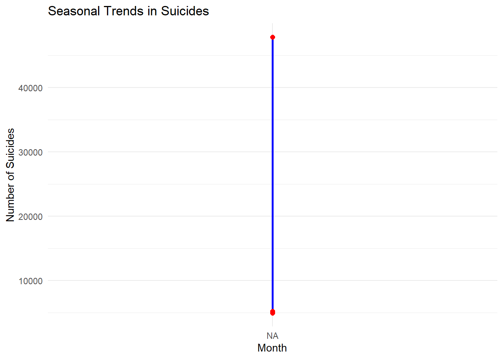
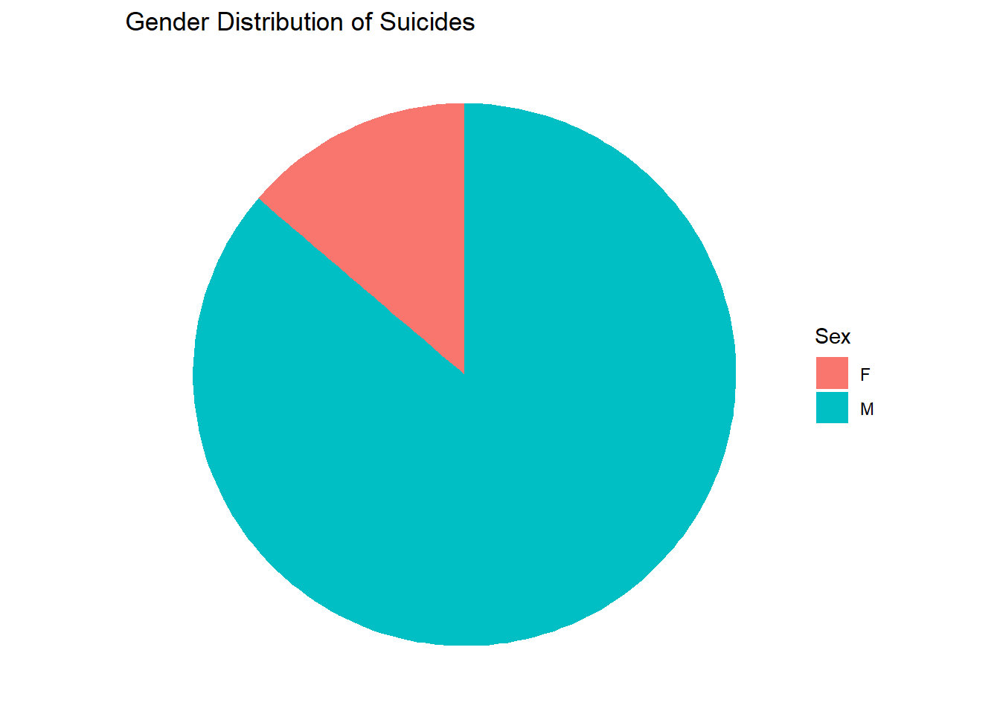

## Summary

Gun deaths in the United States are a significant public health issue, with suicides comprising the majority of these deaths. Notably, 85% of suicides involve males. This analysis uses data from FiveThirtyEight (https://fivethirtyeight.com/features/gun-deaths/) to explore seasonal trends and demographic patterns in suicides, providing actionable insights for targeted prevention campaigns.

## Data Loading and Preparation


::: {.cell}

```{.r .cell-code}
library(ggplot2)
library(dplyr)
library(readr)
library(tidyr)

# Load the dataset
url <- "C:/Users/jonat/Documents/GitHub/W03-Task-Reducing-Gun-Deaths/full_data.csv"
data <- read_csv(url, show_col_types = FALSE)

print(head(data))
```

::: {.cell-output .cell-output-stdout}

```
# A tibble: 6 × 11
   ...1  year month intent  police sex     age race     hispanic place education
  <dbl> <dbl> <chr> <chr>    <dbl> <chr> <dbl> <chr>       <dbl> <chr> <chr>    
1     1  2012 01    Suicide      0 M        34 Asian/P…      100 Home  BA+      
2     2  2012 01    Suicide      0 F        21 White         100 Stre… Some col…
3     3  2012 01    Suicide      0 M        60 White         100 Othe… BA+      
4     4  2012 02    Suicide      0 M        64 White         100 Home  BA+      
5     5  2012 02    Suicide      0 M        31 White         100 Othe… HS/GED   
6     6  2012 02    Suicide      0 M        17 Native …      100 Home  Less tha…
```


:::

```{.r .cell-code}
data$month <- factor(data$month, levels = as.character(1:12), labels = month.abb)


# Filter data for suicides only and clean up missing values
suicides <- data %>% 
  filter(intent == "Suicide" & !is.na(age))

# Add age groups
suicides <- suicides %>% 
  mutate(age_group = cut(age, 
                         breaks = c(0, 14, 34, 64, 100), 
                         labels = c("0-14", "15-34", "35-64", "65+"), 
                         include.lowest = TRUE))
```
:::


## Visualizations

### Seasonal Trends in Suicides


::: {.cell}

```{.r .cell-code}
# Group by month to analyze seasonal trends
monthly_suicides <- suicides %>% 
  group_by(month) %>% 
  summarise(count = n())

# Ensure month is treated as a factor
monthly_suicides$month <- factor(monthly_suicides$month, 
                                 levels = as.character(1:12), 
                                 labels = month.abb)

# Plot seasonal trends in suicides
ggplot(monthly_suicides, aes(x = month, y = count)) + 
  geom_line(group = 1, color = "blue", linewidth = 1) + 
  geom_point(color = "red", size = 2) + 
  labs(title = "Seasonal Trends in Suicides", 
       x = "Month", 
       y = "Number of Suicides") + 
  theme_minimal()
```

::: {.cell-output-display}
{width=672}
:::
:::


**Insight**: Suicide rates fluctuate across the months, with noticeable peaks in certain seasons. This information can help schedule campaigns during critical months.

### Gender Distribution


::: {.cell}

```{.r .cell-code}
# Gender distribution of suicides
gender_distribution <- suicides %>% 
  group_by(sex) %>% 
  summarise(count = n())

# Plot gender distribution as a pie chart
ggplot(gender_distribution, aes(x = "", y = count, fill = sex)) + 
  geom_bar(stat = "identity", width = 1) + 
  coord_polar(theta = "y") + 
  labs(title = "Gender Distribution of Suicides", fill = "Sex") + 
  theme_void()
```

::: {.cell-output-display}
{width=672}
:::
:::


**Insight**: A staggering 85% of suicides involve males, emphasizing the need for male-focused mental health campaigns.

### Age Group Analysis


::: {.cell}

```{.r .cell-code}
# Age group distribution of suicides
age_group_distribution <- suicides %>% 
  group_by(age_group) %>% 
  summarise(count = n())

# Plot age group distribution as a bar chart
ggplot(age_group_distribution, aes(x = age_group, y = count)) + 
  geom_bar(stat = "identity", fill = "cornflowerblue") + 
  labs(title = "Suicides by Age Group", 
       x = "Age Group", 
       y = "Number of Suicides") + 
  theme_minimal()
```

::: {.cell-output-display}
{width=672}
:::
:::


**Insight**: Individuals aged 15–34 and 35–64 account for the majority of suicides. Campaigns should target these vulnerable age groups.

### Regional Heatmap


::: {.cell}

```{.r .cell-code}
# Group by state and month to analyze regional patterns
state_monthly_suicides <- suicides %>% 
  group_by(place, month) %>% 
  summarise(count = n(), .groups = "drop") %>% 
  pivot_wider(names_from = month, values_from = count, values_fill = 0)

# Convert to long format for heatmap
state_monthly_suicides_long <- state_monthly_suicides %>% 
  pivot_longer(cols = -place, names_to = "month", values_to = "count")

# Ensure month is treated as a factor with proper order
state_monthly_suicides_long$month <- factor(state_monthly_suicides_long$month, 
                                            levels = as.character(1:12), 
                                            labels = month.abb)

# Plot heatmap
ggplot(state_monthly_suicides_long, aes(x = month, y = place, fill = count)) + 
  geom_tile() + 
  scale_fill_gradient(low = "white", high = "blue") + 
  labs(title = "Heatmap of Suicides by Location and Month", 
       x = "Month", 
       y = "Location", 
       fill = "Number of Suicides") + 
  theme_minimal()
```

::: {.cell-output-display}
{width=672}
:::
:::


**Insight**: Geographical and seasonal patterns indicate critical areas for targeted intervention, such as specific locations with high suicide rates.

## Conclusion

The analysis identifies critical trends in suicides across months, demographics, and locations. These insights can guide targeted and timely campaigns to reduce gun deaths in the U.S.
